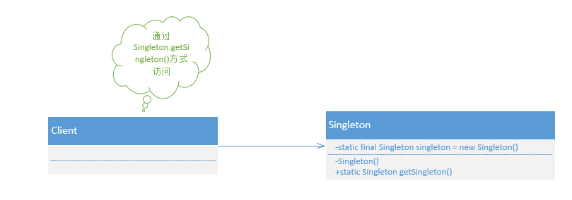

# 单例模式

## 1.单例模式的定义：

Ensure a class has only instance,and provide a global point of access to it.

确保一个类只有一个实例,而且自行实例化并向整个系统提供这个实例。



单例模式通用代码:

```java
public class Singleton {
    private static final Singleton SINGLETON = new Singleton();

    // 限制产生多个实例
    private Singleton() {

    }

    // 通过该方法获得实例对象
    public static Singleton getSingleton() {
        return SINGLETON;
    }

    // 类中其他方法，尽量是static
    public static void doSomethings() {
        System.out.println("我是单例");
    }
}
```

## 2. 单例模式的注意事项:

在高并发环境下,需要注意单例模式的线程同步问题。

单例模式有几种实现方式,上面的例子不会产生出现多个实例的情况，但如下实现就需要考虑线程同步:

```java
// 线程不安全的单例模式实现
public class NoSafeSingleton {
    public static NoSafeSingleton noSafeSingleton = null;

    private NoSafeSingleton() {

    }

    public static NoSafeSingleton getInstance() {
        if (noSafeSingleton == null) {
            noSafeSingleton =  new NoSafeSingleton();
        }
        return noSafeSingleton;
    }
}
```

其次，需要考虑对象复制的情况。在Java中，对象默认是不可以被复制的，若实现了Cloneable接口，并实现了clone方法，则可以直接通过对象复制的方式创建一个新的对象。

## 3. 单例模式的扩展

```java
import java.util.ArrayList;
import java.util.Random;

public class FiexdQuantitySingleton {
    // 定义最多能产生的实例数量
    private static int maxNumOfSingleton = 2;
    // 维护每个实例的属性信息
    private static ArrayList<String> nameList = new ArrayList<String>();
    // 定义一个列表，容纳所有的皇帝实例
    private static ArrayList<FiexdQuantitySingleton> singletons = new ArrayList<FiexdQuantitySingleton>();
    // 当前皇帝的序列号
    private static int countNumOfSingleton = 0;
    // 产生所有的对象
    static {
        for (int i = 0; i<maxNumOfSingleton; i++) {
            singletons.add(new FiexdQuantitySingleton("实例:" + i ));
        }
    }
    private FiexdQuantitySingleton() {

    }

    private FiexdQuantitySingleton(String name) {
        nameList.add(name);
    }

    // 随机获取一个实例对象
    public static FiexdQuantitySingleton getInstance() {
        Random random = new Random();
        countNumOfSingleton = random.nextInt(maxNumOfSingleton);
        return singletons.get(countNumOfSingleton);
    }

    // 实例的方法
    public void say() {
        System.out.println(nameList.get(countNumOfSingleton));
    }
}
```

## 4. 最佳实践

单例模式应用十分广泛，例如在Spring中，每个Bean默认就是单例的,这样做的优点是Spring容器可以管理这些Bean的生命周期，决定什么时候创建出来，什么时候销毁，销毁的时候要如何处理，等等。如果采用非单例模式(Prototype类型),则Bean初始化后的管理交由J2EE容器，Spring容器不再跟踪管理Bean的生命周期。