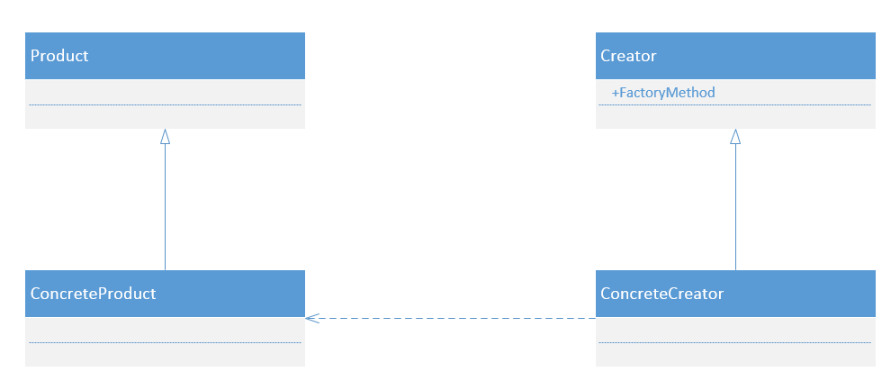

# 工厂模式

## 1. 工厂模式的定义:

Define an interface for creating an object, but let subclassed decide which class to instantiate.Factory Method lets a class defer instantition to subclassed.

定义一个用于创建对象的接口，让子类决定实例化哪一个类。工厂方法使一个类的实例化延迟到其子类。

工厂模式的通用类图:

