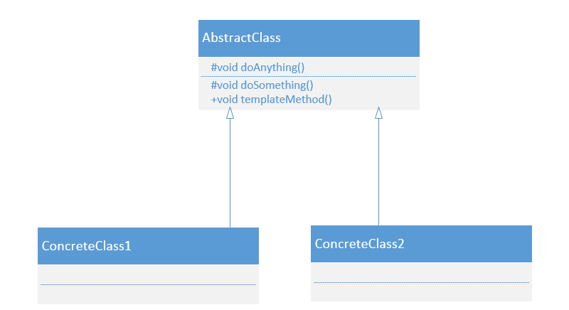
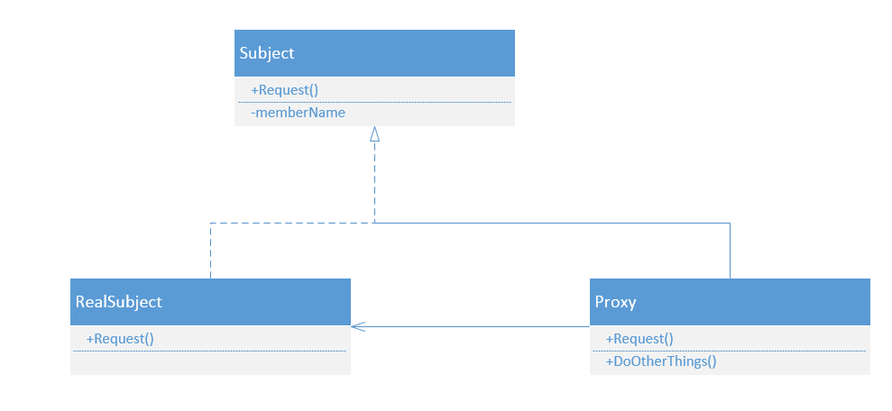

# 模板方法模式

模板方法模式定义：

定义一个操作中的算法框架，而将一些步骤延迟到子类中。使得子类可以不改变一个算法的结构即可重定义该算法的某些特定步骤。

模板方法的模式确实非常简单，仅仅使用了Java的继承机制，但它是一个应用非常广泛的模式。其中,AbstractClass叫做抽象模板，它的方法分为两类：

基本方法：

基本方法也叫做基本操作，是由子类实现的方法，并且在模板方法被调用。

模板方法：

可以有一个或几个，一般是一个具体的方法，也就是一个框架，实现对基本方法的调度，完成固定的逻辑。

# 建造者模式

建造者模式也叫做生成器模式，其定义如下：

将一个复杂对象的构建与它的表示分离，使得同样的构建过程可以创建不同的表示。

# 代理模式

Provide a surrogate or placeholder for another object to control access to it.

为其他对象提供一种代理以控制对这个对象的访问。

代理模式也叫作委托模式。代理模式可以提供非常好的访问控制。

动态代理：

在实现阶段不用关心代理谁，而是在运行阶段才决定代理哪一个对象。

# 中介者模式

中介者模式的定义为：Define an object that encapsulates how a set of objects interact.Mediator promotes loose coupling by keeping objects from referring to each other explicitly, and it lets you vary their interaction independently.

用一个中介者对象封装一系列对象的交互，中介者使个对象不需要显示地相互作用，从而使其耦合松散，而且可以独立地改变他们之间的交互。

# 责任链模式

使多个对象都有机会处理请求，从而避免了请求的发送者和接受者之间的耦合关系。将这些对象连成一条链，并沿着这条链传递该请求，直到有对象处理这条请求为止。

# 装饰模式

动态的给对象添加一些额外的职责。就增加功能来说，装饰模式相比生成子类更为灵活。

# 策略模式

定义一组算法，将每个算法都封装起来，并且使它们之间可以互换。

# 适配器模式

将一个类的接口变换成客户端所期待的另一种接口，从而使原本因接口不匹配而无法在一起工作的两个类能够在一起工作。

# 观察者模式

观察者模式也叫做发布订阅者模式，定义对象间一种一对多的依赖关系，使得每当一个对象改变状态，则所有依赖于它的对象都会得到通知并且被自动更新。

# 门面模式

门面模式也叫做外观模式，是一种比较常用的封装模式。

要求一个子系统的外部与其内部的通信必须通过一个统一的对象进行。门面模式提供一个高层次的接口，使得子系统更易使用。